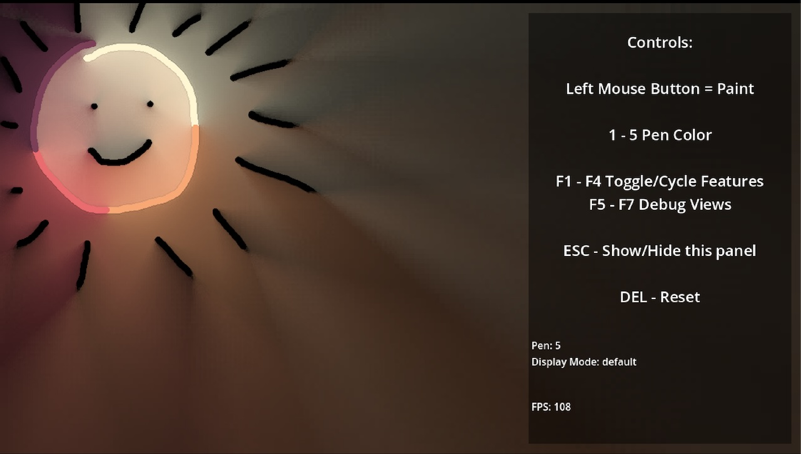
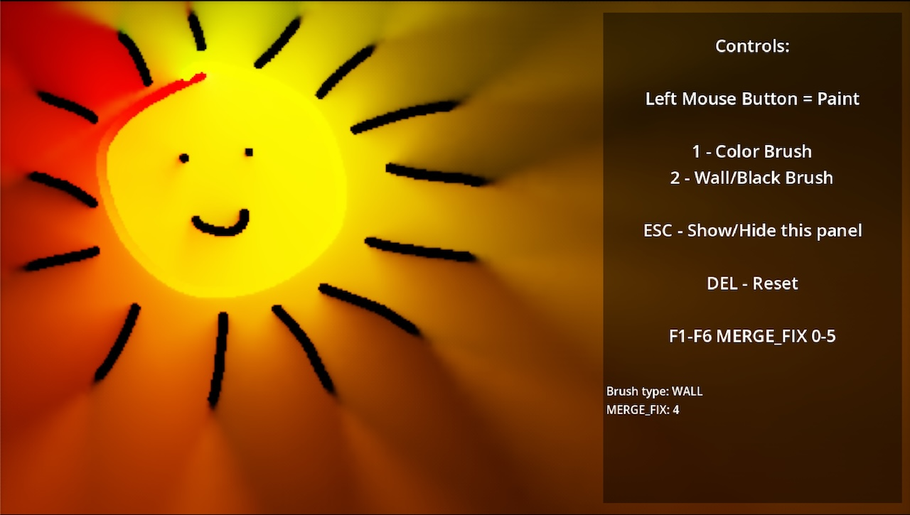
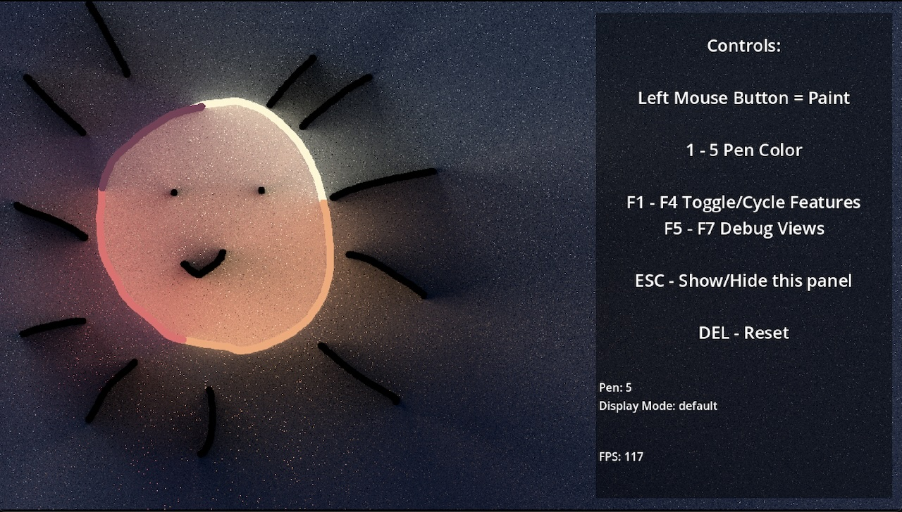
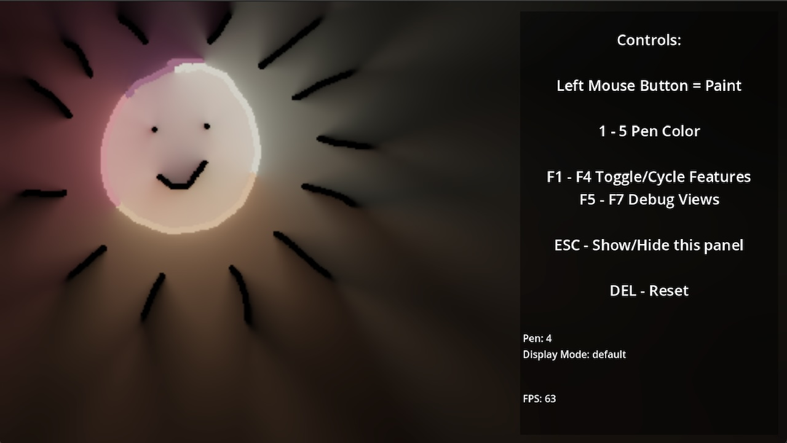

# radiance-cascades-godot
basic port of Radiance Cascades shadertoy implementation

1. mix-Yaazarai-and-jason - Godot 4.3 implementation of [Radiance Cascades: A Novel Approach to Calculating Global Illumination](https://drive.google.com/file/d/1L6v1_7HY2X-LV3Ofb6oyTIxgEaP4LOI6/view) by Alexander Sannikov
    * Credit: uses a mix of Yaazrari's [GameMaker implementation/blog](https://mini.gmshaders.com/p/radiance-cascades2?utm_campaign=post&utm_medium=web) and jason-today's [JavaScript implementation/blog](https://jason.today/gi)
    * i have other versions below - but this is the most performant and cleanest
    * note: is implemented in compute shaders so does not include hardware sampling optimization
    * 

1. shadertoy-port-suslik - Godot 4.3 port of [RC Experimental Testbed](https://www.shadertoy.com/view/4ctXD8) Credit tree:

    * [RC Experimental Testbed](https://www.shadertoy.com/view/4ctXD8) (Created by Suslik 2024-04-24) is a fork of 
    * [Fork Fork Radia Suslik 677](https://www.shadertoy.com/view/MctXRr) (Created by Suslik 2024-04-19) is a fork of
    * [Fork Radiance C Quinchilio 468](https://www.shadertoy.com/view/clVcD3) (Created by Quinchilion 2023-11-23) is a fork of
    * [Radiance Cascades](https://www.shadertoy.com/view/mtlBzX) (Created by fad 2023-09-02) is a 2D implementation of
    * [Radiance Cascades: A Novel Approach to Calculating Global Illumination](https://drive.google.com/file/d/1L6v1_7HY2X-LV3Ofb6oyTIxgEaP4LOI6/view) Alexander Sannikov
    * 

1. jason-today-gi-pt1 - Godot 4.3 port of [Building Real-Time Global Illumination: Part 1](https://jason.today/gi)

    * [Building Real-Time Global Illumination: Part 1](https://jason.today/gi) (By Jason McGhee, 2024)
    * Pt1 is a prequal for radience cascases showing how to do global illumination. i highly recommend going through Jason's blog 
    * 

1. try-mix-jason-and-shadertoy - using jason-today to create distance map and shadertoy to render
    * kinda works but performance is not great
    * 

### learn radiance-cascades

* Discord: [Graphics Programming Discord](https://discord.gg/6mgNGk7)
* Paper: [Radiance Cascades: A Novel Approach to Calculating Global Illumination](https://drive.google.com/file/d/1L6v1_7HY2X-LV3Ofb6oyTIxgEaP4LOI6/view) Alexander Sannikov
* Interavtive Blog + web implementation of 2d gi: [Building Real-Time Global Illumination: Part 1](https://jason.today/gi) 
* Interactive Blog + web implementation: [tmpvar's radiance cascades 2D playground](https://tmpvar.com/poc/radiance-cascades/)
* Blog: [gmshaders](https://mini.gmshaders.com/p/radiance-cascades2) 
* Video: [Exploring a New Approach to Realistic Lighting: Radiance Cascades](https://youtu.be/3so7xdZHKxw?si=vB5Xnogr4mJsh2c-)
* Video [Mytino](https://youtu.be/6O9-BUDk_-c?si=7IRhuZeUWgX7ndWA)
